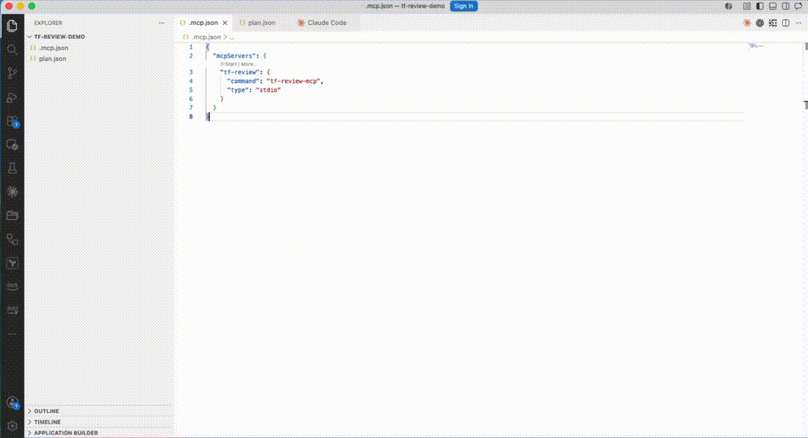

# tf-review-mcp

[](#status)
[](LICENSE)
[](pyproject.toml)

An MCP server that reviews Terraform plans for blast radius, stateful destroys, and high-risk resource changes. Plug it into Claude Desktop, Cursor, Claude Code, or any MCP client to get structured plan review on demand.

> **Status:** v0.3.1, experimental. Tool contracts may change before 1.0. Issues and PRs welcome.



See [DESIGN.md](DESIGN.md) for architecture, threat model, and the existing-tools survey.

## Why

`terraform plan` outputs are long. Risky changes (IAM edits, security-group churn, RDS replacements) get missed in PR reviews. This server parses `terraform show -json` output and surfaces the things a human reviewer actually cares about, so a model can read them and write useful comments instead of summarizing the whole diff.

## What it does

Four tools:

- `review_plan(plan_json_path)` — returns a structured summary: action counts (create/update/delete/replace), high-blast-radius resource changes, stateful destroys, and diff-aware public-exposure findings.
- `suggest_review_comments(plan_json_path)` — returns a list of `{address, severity, comment}` objects ready to drop into a PR review. Severities: `blocker | warn | info`.
- `estimate_cost_delta(plan_json_path)` — wraps the [Infracost](https://www.infracost.io/) CLI to return the projected monthly cost delta, top cost contributors, and threshold-based notes.
- `get_active_config()` — returns the merged `ReviewConfig` (built-in defaults plus any `.tf-review.yml` overrides). Useful for debugging when an expected finding doesn't appear.

What gets flagged:

- **High-risk types** (warn). Conservative built-in list across AWS, GCP, and Azure: IAM, RDS, KMS, security groups, S3, EKS, GKE, Cloud SQL, GCS, Cloud DNS, GCE firewalls, AKS, Key Vault, etc.
- **Stateful destroys** (blocker). RDS/Cloud SQL/DynamoDB/GCS/S3 deletes or replaces, plus `google_compute_instance` replaces (boot disk + local SSD loss).
- **Public exposure** (blocker). Diff-aware: catches `google_compute_firewall` changes that add `0.0.0.0/0` or `::/0` to `source_ranges`.
- **Cost delta** (informational). Total monthly delta plus per-resource top contributors. Notes escalate at `$100`, `$500`, and `$1000` thresholds.

## Install

```bash
git clone https://github.com/your-user/tf-review-mcp.git
cd tf-review-mcp
pip install -e .
```

Requires Python 3.11+.

### Optional: Infracost for `estimate_cost_delta`

The `estimate_cost_delta` tool shells out to the Infracost CLI. Install it
once and authenticate (the API token is free for individual use):

```bash
brew install infracost
infracost auth login
```

If `infracost` is not on `PATH`, the tool returns a structured error
explaining how to install it. The other tools work without Infracost.

## Generate a plan to review

```bash
terraform plan -out plan.out
terraform show -json plan.out > plan.json
```

## Use it from Claude Desktop

Add to `~/Library/Application Support/Claude/claude_desktop_config.json`:

```json
{
  "mcpServers": {
    "tf-review": {
      "command": "tf-review-mcp"
    }
  }
}
```

Restart Claude Desktop. Then ask: *"Review the plan at /path/to/plan.json and suggest PR comments."*

## Use it from the command line

```bash
python -c "from tf_review_mcp.review import review_plan_file; \
  import json; print(json.dumps(review_plan_file('plan.json').to_dict(), indent=2))"
```

## Sample output

Given a plan that replaces an RDS instance and modifies a security group:

```json
{
  "counts": {"replace": 1, "update": 2, "create": 2},
  "stateful_destroys": [
    {"address": "aws_db_instance.primary", "type": "aws_db_instance", ...}
  ],
  "notes": [
    "1 stateful resource(s) scheduled for destroy/replace. Verify backups and migration plan before applying."
  ]
}
```

## Tests

```bash
pip install -e ".[dev]"
pytest
```

## Configuration

Drop a `.tf-review.yml` at the root of your Terraform repo to extend the
built-in rules without forking. All fields are optional; missing fields
fall back to defaults.

```yaml
version: 1

# Add resource types to the built-in HIGH_RISK_TYPES list (flagged `warn`).
extra_high_risk_types:
  - cloudflare_record
  - vault_policy

# Add resource types to the built-in STATEFUL_TYPES list
# (flagged `blocker` on delete/replace).
extra_stateful_types:
  - mongodbatlas_cluster

# Extra CIDRs treated as "public exposure" for google_compute_firewall.
extra_public_cidrs:
  - "10.0.0.0/8"

# Override the cost-delta thresholds (USD per month).
cost_thresholds:
  info_usd: 50
  warn_usd: 250
  blocker_usd: 1500

# Suppress specific rules entirely. Known rule ids:
#   high-risk, stateful-destroy, public-exposure, cost-delta
disabled_rules:
  - public-exposure
```

Discovery order:

1. `TF_REVIEW_CONFIG=/abs/path/config.yml` (env var override).
2. `.tf-review.yml` in the current working directory.
3. Walk up parent directories until the filesystem root.
4. Built-in defaults.

Call `get_active_config` from the MCP client to see the merged
configuration the server is actually using.

## Roadmap

- `check_policy` (run OPA/Conftest against the plan).
- More diff-aware checks: `aws_security_group` ingress widening, `google_storage_bucket` `force_destroy` toggles, IAM `*` role grants.

## License

MIT.
